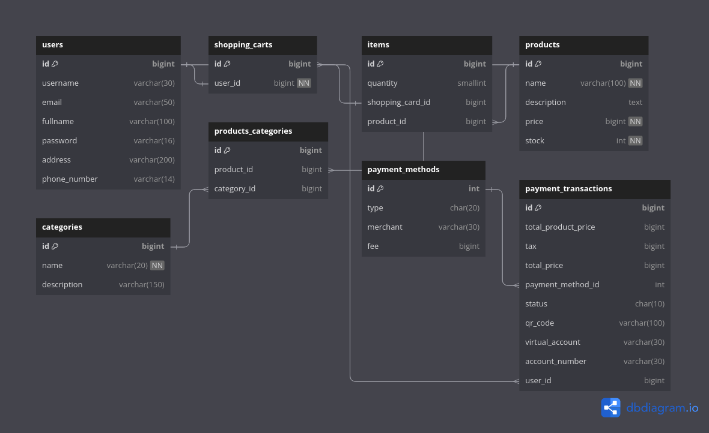

# Synapsis Backend Test

## Available Endpoints

### GET `/v1/products`

**Description:** Retrieve a list of all available products.

**Usage:** Use this endpoint to fetch a list of all products offered by the API.

### POST `/v1/auth/login`

**Description:** Authenticate users using their username and password. Upon successful authentication, the server responds with a JSON Web Token (JWT) for further access.

**Usage:** Use this endpoint to log in to the system and obtain a JWT token for subsequent authenticated requests.

### POST `/v1/auth/register`

**Description:** Register a new user with the system using their username, email, full name, and password.

**Usage:** Use this endpoint to create a new user account in the system.

### GET `/v1/carts`

**Description:** Retrieve all products currently in the user's shopping cart.

**Authentication:** Requires authentication using a JWT token.

**Usage:** Use this endpoint to view the contents of the shopping cart.

### POST `/v1/carts`

**Description:** Add a product to the user's shopping cart.

**Authentication:** Requires authentication using a JWT token.

**Usage:** Use this endpoint to add a product to the user's shopping cart.

### POST `/v1/carts/checkout`

**Description:** Checkout all products currently in the user's shopping cart.

**Authentication:** Requires authentication using a JWT token.

**Usage:** Use this endpoint to complete the checkout process for all products in the shopping cart.

## Documentation

For more detailed documentation on each endpoint, including request and response formats, refer to the Swagger documentation provided by the API.

## How To Run

### Prerequisites

- Go 1.21.3 +
- Docker
- Makefile

### Steps

1. Create docker network
   Before running the application, create a Docker network to ensure proper communication between containers.

```sh
make network
```

2. Pull and Run PostgreSQL Container
   Pull the PostgreSQL Docker image and run it as a container.

```sh
make postgres
```

3. Create database `synapsis_db`
   Use the following command to create the PostgreSQL database named `synapsis_db`.

```sh
make createdb
```

4. Run Database Migration
   Perform database migration to set up the schema.

```sh
make migrate_up
```

5. Seed Database
   Populate the database with initial data (if applicable).

```sh
make seed
```

6. Build the API Image
   Build the Docker image for the API.

```sh
make build_api
```

7. Run the API Container
   Launch the Docker container for the API.

```sh
make server_api
```

## Database Schema



With dbdiagram.io => https://dbdocs.io/kholidbughowi/synapsis-backend-test-database?view=relationships
